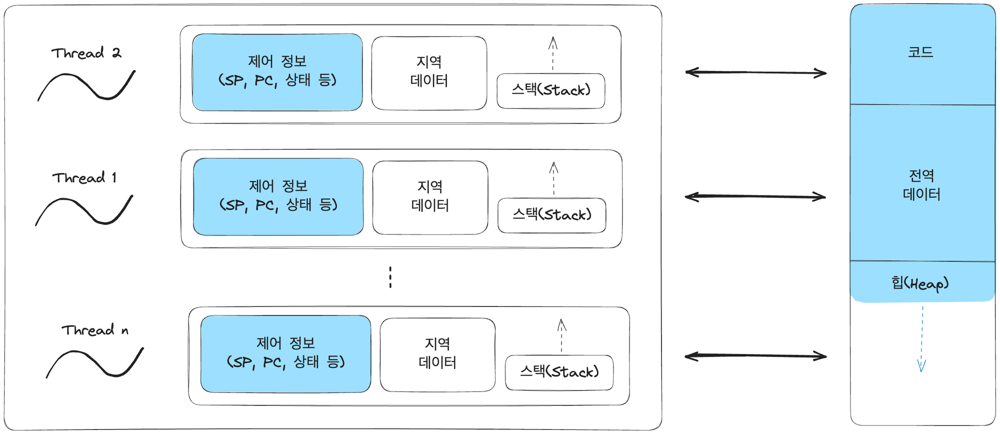
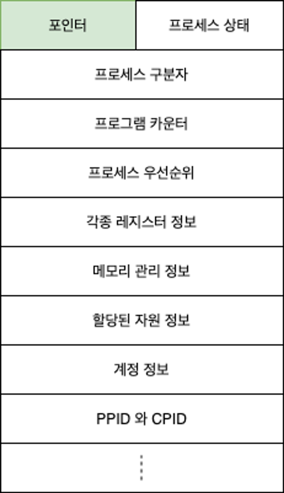
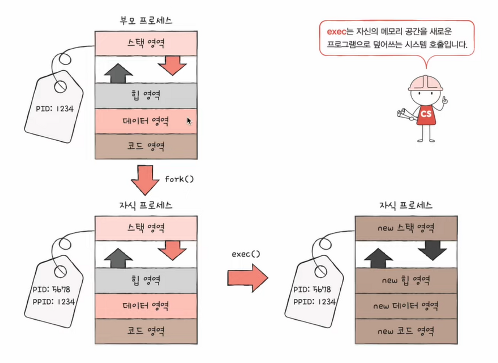

## 💡프로세스가 무엇인가요?

> **프로세스(Process)**란 _메모리에 적재되어 운영체제(OS)로부터 CPU를 할당받아 실행 중인 프로그램_을 의미한다.  또한 **프로세스 제어 블록(PCB)**을 가진다는 점이 프로그램과의 가장 중요한 차이이다.

**✔ 핵심 정의**
- `프로세스(Process)`: 실행을 위해 메모리에 올라온 프로그램 + **PCB**
- `프로그램(Program)`: 저장 장치(HDD/SSD)에 있는 **정적 상태의 코드**
- `프로세스`는 `동적`, `프로그램`은 `정적`

**✔ 프로세스의 특징**
- OS가 관리하는 독립적인 실행 단위
- CPU, 메모리, 파일 등 시스템 자원을 요청/할당/반납하면서 실행됨
- 각 프로세스는 고유한 **PID(Process ID)**를 가짐

### 프로그램 vs 프로세스
| 구분  | 프로그램(Program)   | 프로세스(Process)          |
| --- | --------------- | ---------------------- |
| 상태  | 정적(Static)      | 동적(Dynamic)            |
| 위치  | 저장장치(HDD/SSD 등) | 메모리(RAM)               |
| 구성  | 명령어 + 데이터       | 프로그램 + **PCB** + 실행 상태 |
| 의미  | 실행 전 코드 묶음      | 실행 중인 작업               |

### 프로그램에서 프로세스로의 전환

> 운영체제는 프로그램을 메모리의 적당한 위치로 가져오고, 이때 **프로세스 제어 블록(PCB, Process Control Block)**을 만든다. 어떤 프로그램이 프로세스가 됐다는 것은 운영체제로부터 프로세스 제어 블록을 받았다는 것을 의미한다. 프로세스가 종료되면 프로세스는 메모리에서 삭제되고, 프로세스 제어 블록도 페기된다.
1. 프로그램을 메모리로 적재(Load)
2. PCB(Process Control Block) 생성
3. CPU 스케줄러가 Ready Queue에 등록
4. CPU가 배정되면 실행(Running 상태)
5. 종료 시 프로세스 메모리 + PCB 제거
- 프로세스 = 프로그램 + 프로세스 제어 블록
- 프로그램 = 프로세스 - 프로세스 제어 블록

### 프로세스의 상태(State)

프로세스는 실행 과정에서 다음 상태를 이동한다.
- **생성(Create)**
- **준비(Ready)**
- **실행(Running)**
- **대기(Waiting/Blocked)**
- **종료(Terminated)**
일괄 작업 시스템에서는 단순히 Create → Run → Terminate만 사용했지만,  
현대 OS에서는 위와 같은 5-state 모델 또는 그 이상을 사용한다.

## 📑 꼬리질문

### 프로그램, 프로세스, 스레드의 차이?

→ 프로그램과 프로세스는 PCB를 할당 받았는지에 차이가 있고, 자원 할당 유무를 통해서 확인할 수 있다.  
→ 스레드는 자원을 할당 받은 프로세스가 프로세서를 활용해 자원을 제어하는 기본 단위로 쓰인다.

| 구분      | 프로그램    | 프로세스        | 스레드          |
| ------- | ------- | ----------- | ------------ |
| 정의      | 실행 전 코드 | 실행 중인 작업 단위 | 프로세스 내 실행 흐름 |
| 상태      | 정적      | 동적          | 동적           |
| 메모리     | 없음      | 독립된 메모리 공간  | 프로세스 메모리 공유  |
| PCB/TCB | 없음      | PCB 가짐      | TCB 가짐       |
**✔ 스레드는 PCB를 가질까?**

- 스레드는 **TCB(Thread Control Block)**을 가진다.
- 리눅스는 사실상 **스레드도 ‘태스크(task)’로 같은 구조체(task_struct)를 사용**하여 관리한다.
### PCB(Process Control Block)란?

프로세스 관련 모든 정보를 담고 있는 운영체제의 핵심 자료구조.
**✔ PCB에 저장되는 정보**
- **프로세스 ID (PID)**
- **프로세스 상태** (Ready / Running / Blocked …)
- **Program Counter** (다음 수행 명령어 위치)
- **CPU 레지스터 정보**
- **메모리 구조 정보** (Code / Data / Heap / Stack)
- **열린 파일 / 리소스 핸들**
- **스케줄링 정보** (우선순위 등)

> PCB는 운영체제 커널 영역에 존재하며, 프로세스 문맥(context)을 관리하는 데 사용된다.
### 리눅스에서 프로세스/스레드 생성 방법?

**✔ 프로세스 생성**
	리눅스는 부팅할 때 커널을 작동시킨다. 해당 커널은 Init 프로세스를 실행한다. 이때에 Init Process는 모든 프로세스의 부모 프로세스 역할을 수행한다..
- `fork()` 시스템 콜
    - 부모 프로세스를 복사하여 자식 프로세스 생성
    - Copy-on-Write 최적화 적용(부모 프로세스의 복사본이기 때문에 부모 프로세스의 자원들, 메모리의 내용 및 열린 파일의 목록 등이 자식 프로세스에 상속된다.)
- 이후 `exec()`으로 새로운 프로그램으로 덮어씀
	- 자식 프로세스는 exec() 시스템 호출을 통해 새로운 프로그램으로 전환된다. exec는 자신의 메모리 공간을 새로운 프로그램으로 덮어쓰는 시스템 호출이다.
    
**✔ 스레드 생성**
- 리눅스는 내부적으로 **clone()** 시스템 콜을 사용
- `pthread_create()` 역시 clone 기반
- clone 플래그에 따라 “메모리 공유 여부”가 결정됨 → 스레드인지 프로세스인지 갈림
### 부모 프로세스가 먼저 죽거나, 자식 프로세스가 먼저 죽으면?
**✔ 자식이 먼저 종료된 경우 → Zombie(좀비) 프로세스 발생**
- 프로세스는 종료됐지만 PCB가 남아 있는 상태
- 부모 프로세스가 `wait()`를 호출하면 회수됨  

**✔ 부모가 먼저 종료된 경우 → Orphan(고아) 프로세스 발생**
- 자식 프로세스는 고아가 되어 **init(1) 또는 systemd가 부모로 재설정**
- 이후 정상적으로 종료 처리됨

### 데몬(Daemon) 프로세스란?
사용자 세션과 독립적으로 **백그라운드에서 영구적으로 동작하는 프로세스**.

예: `inetd`, `sshd`, `crond`, `systemd` 등

 **✔ 데몬 프로세스 특징**
- 터미널/세션과 분리 (no controlling terminal)
- 보통 **double fork** 기법으로 생성
- 로그 파일을 남기며 지속적 서비스 수행